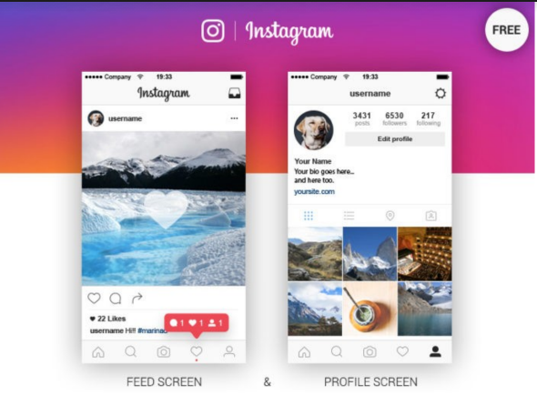
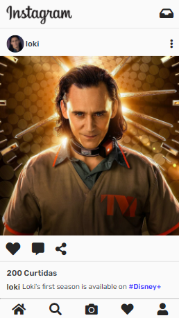
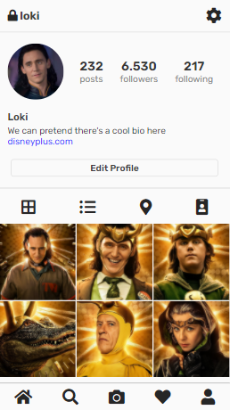

# clone-instagram

Clone de algumas telas do Instagram utilizando HTML e CSS para um projeto da disciplina de Desenvolvimento web III do curso de Análise e Desenvolvimento de Sistemas, IFPE.

### Sobre o Projeto

O projeto visa clonar duas telas do Instagram (baseadas nas da imagem abaixo) para um pequeno projeto da disciplina de Desenvolvimento web III com o intuito de revisar HTML e CSS. 

### Resultado

O resultado das telas ficou dessa forma, seguindo a dimensão "Pixel 2" das ferramentas do desenvolvedor no navegador. Fiz algumas alterações que deixaram os itens mais parecidos com o layout usado no Instagram atualmente, mudanças relacionadas à posição dos elementos em tela.

 &nbsp; &nbsp; &nbsp; &nbsp;

### Navegação

É possível ir da página inicial até o perfil clicando no ícone de perfil do usuário no menu inferior, ou no nome do usuário junto à foto de perfil próximo a publicação.
